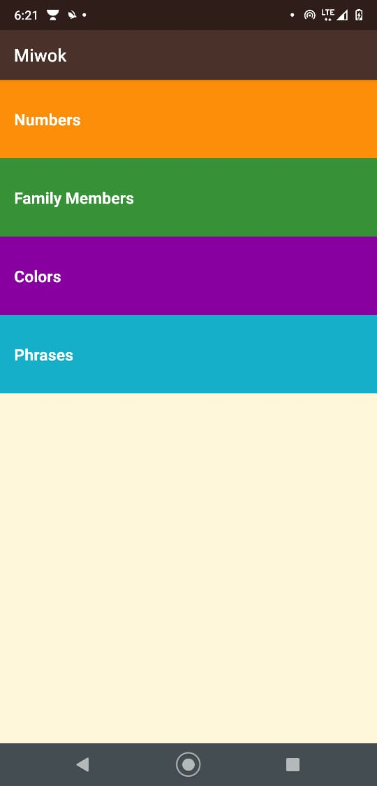
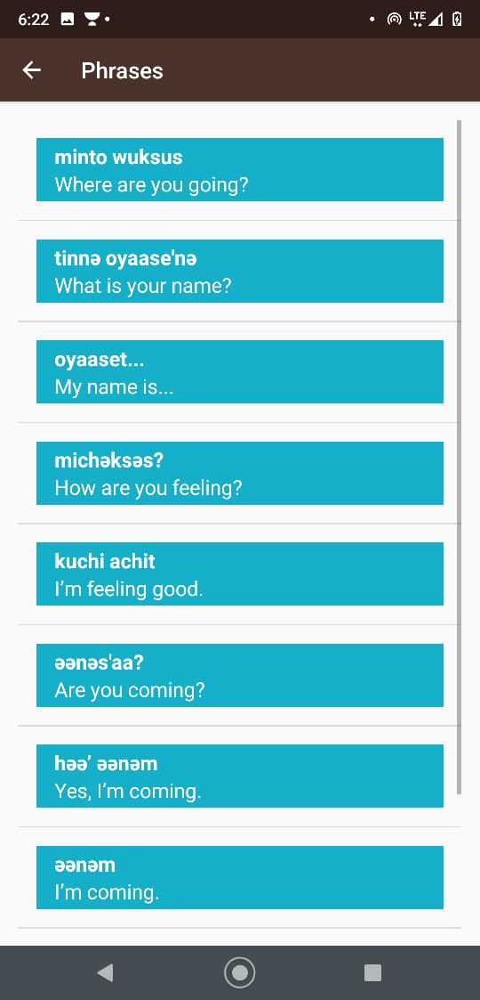
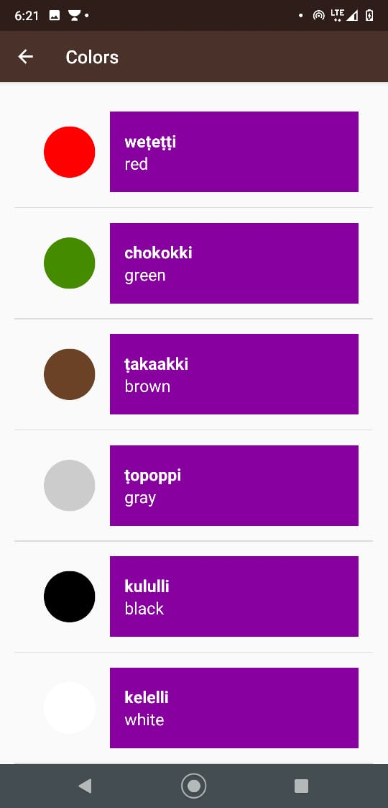
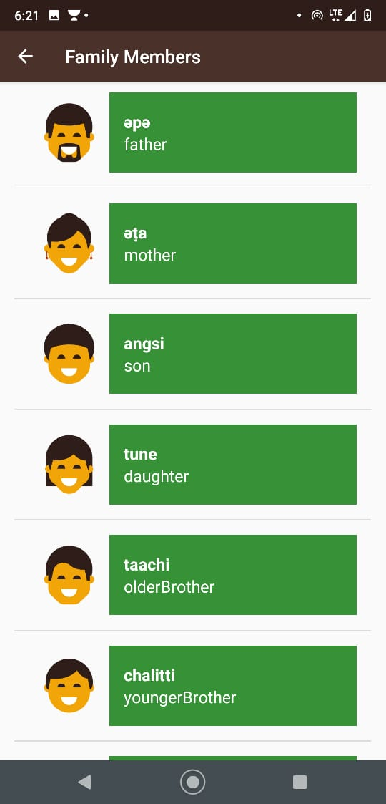
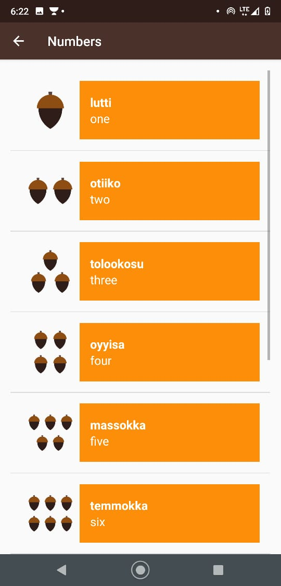

# Miwok
An app to explore the rich native American language Miwok.

The Miwok (also spelled Miwuk, Mi-Wuk, or Me-Wuk) are members of four linguistically related Native American groups indigenous to what is now Northern California, who traditionally spoke one of the Miwok languages in the Utian family. The word Miwok means people in the Miwok language.
An app to explore the language
 
• Sound Integrated 
• Read/hear 

 

